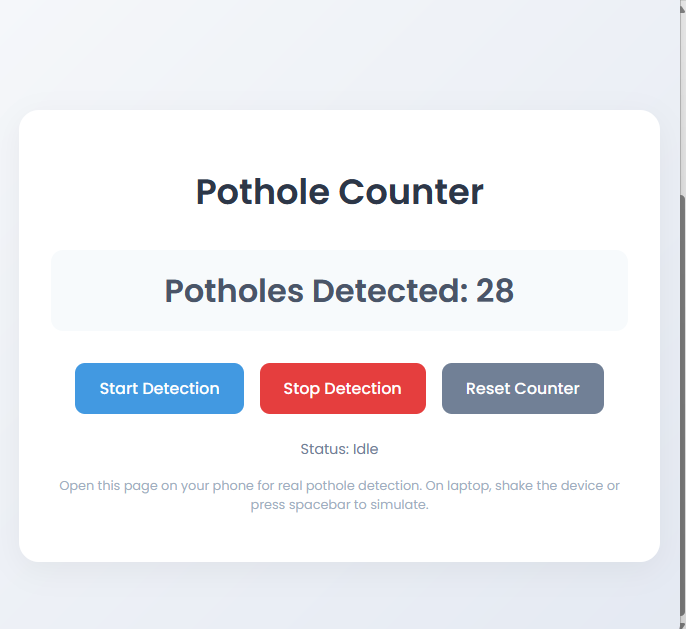
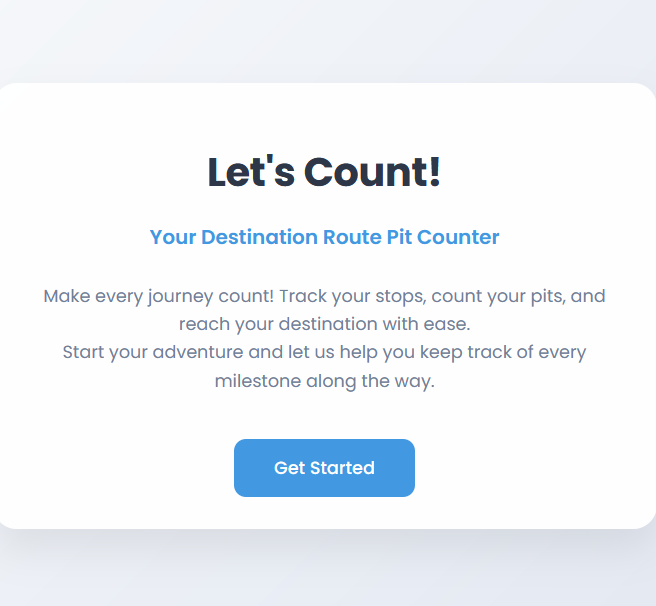
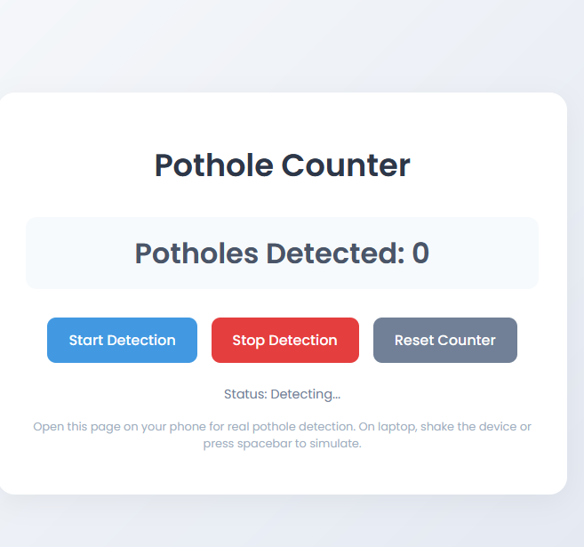

# [Project Name-Pothole Detector] 🎯

## Basic Details
### Team Name: [Hackonauts]

### Team Members
- Member 1: [Hiba Nasrin.P] - [EMEA College]
- Member 2: [Fathima Nidha.M] - [EMEA College]

### Project Description
[A browser-based web app that uses motion sensors to detect and count potholes in real time, helping raise road condition awareness. Future integration with route mapping could guide users to the smoothest, most convenient paths.]

### The Problem (that doesn't exist)
[Road travelers often face unexpected potholes, causing damage, discomfort, and delays, with no simple way to check road conditions in advance.]

### The Solution (that nobody asked for)
[A web-based tool that detects potholes along a route and provides a mapped, safer, and smoother travel path.]

## Technical Details
### Technologies/Components Used
For Software:
- [Languages used-html,css,js]
- [Frameworks used]
- [Libraries used]
- [Tools used-Git,VS Code]

For Hardware:
- [List main components]
- [List specifications]
- [List tools required]

### Implementation
For Software:
# Installation
[commands]

# Run
[commands]

### Project Documentation
For Software:

# Screenshots (Add at least 3)

*Add caption explaining what this shows*

*Add caption explaining what this shows*

*Add caption explaining what this shows*

# Diagrams

*Add caption explaining your workflow*

For Hardware:

# Schematic & Circuit

*Add caption explaining connections*

*Add caption explaining the schematic*

# Build Photos

*List out all components shown*

*Explain the build steps*

*Explain the final build*

### Project Demo
# Video
[Add your demo video link here]
*Explain what the video demonstrates*

# Additional Demos
[Add any extra demo materials/links]

## Team Contributions
- [Name 1]: [Specific contributions]
- [Name 2]: [Specific contributions]
- [Name 3]: [Specific contributions]

---
Made with ❤️ at TinkerHub Useless Projects 

